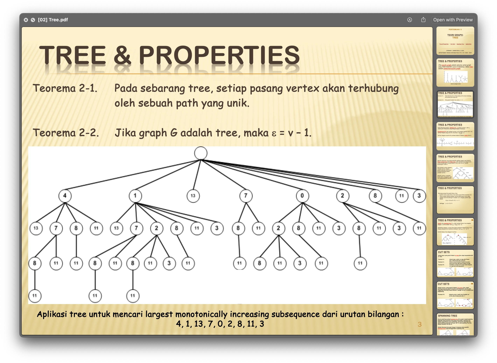

# Praktikum-2-Teori Graf

### Question

Implemantasikan sebuah program untuk menyelesaikan permasalahan “Largest Monotonically Increasing Subsequence”


### Tree

Tree adalah sebuah struktur data yang memiliki ciri tidak memiliki cycle pada datanya (acyclic). Tree juga memiliki ciri $\sum_{edge} = \sum_{vertex} - 1$

Terdapat beberapa istilah yang digunakan pada struktur data tree, seperti:
<l>
<li><b>root:</b> Simpul teratas yang tidak memiliki simpul induk</li>
<li><b>Child Node:</b> Simpul yang memiliki simpul induk dan terhubung ke simpul tersebut.</li>
<li><b>Leaf Node:</b> Simpul tanpa anak, berada di ujung cabang.</li>
<li><b>Parent Node:</b> Simpul yang memiliki setidaknya satu simpul anak.</li>
<li><b>Depth:</b> Jarak dari root node ke simpul tertentu.</li>
<li><b>Level:</b> Generasi simpul dalam tree, dengan root node berada di level 0.</li>
</l>

### Longest Increasing Subsequence (LIS)

#### Definisi:
deretan elemen dalam sebuah urutan yang memiliki karakteristik peningkatan nilai secara berurutan.
Untuk suatu urutan $a_1, a_2, a_2, …, a_n$, LIS adalah subset terpanjang dari elemen-elemen tersebut, di mana elemen-elemen tersebut berrutan dalam urutan yang meningkat.

#### contoh:
Misalkan kita memiliki rutan $10, 22, 9, 33, 21, 50, 41, 60, 80$, maka LIS-nya adalah $10, 22, 33, 50, 60, 80$ dengan panjang 6.

#### algoritma
Untuk mendapatkan jumlah LIS pada suatu sequence, kita dapat menggunakan Dynamic Programming. Berikut adalah langkah - langkahnya:
* Buat array dp dengan panjang yang sama dengan panjang urutan, diinisialisasi dengan nilai 1.
* Iterasi melalui setiap elemen dari urutan belakang.
* Untuk setiap elemen $a_i$ periksa elemen-elemen sebelumnya $a_j$ (dimana $j < i$).
* Jika $a_i > a_j$, update $dp[i]$ dengan nilai maksimum antara $dp[i]$ dan $dp[j] + 1$.
* Panjang LIS terpanjang adalah nilai maksimum dari array $dp$.

### Impementatation in C++

LIS function

```cpp
// Longest Increasing Subsequence
void lis(int n) {
    vector<int> v = getLevel(n);
    vector<int> LIS(v.size(), 1);

    for (int i = v.size() - 1; i >= 0; i--) {
        for (int j = i + 1; j < v.size(); j++) {
            if (v[i] < v[j]) {
                LIS[i] = max(LIS[i], 1 + LIS[j]);
            }
        }
    }
    cout << "LIS: " << *max_element(LIS.begin(), LIS.end()) << endl;
}
```
